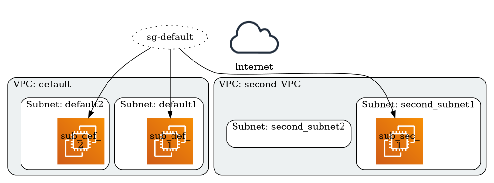

# tfviz

Terraform is an amazing tool, but it can sometimes be hard to understand Terraform deployments when they are composed of many resources across many files. Having a tool that create a graph from Terraform files will facilitate Terraform usage.

**tfviz** will help you understanding and documenting your Terraform deployments. It can also be very useful to keep network schema up-to-date in your documentation/wiki or to perform Threat Modeling of cloud based services.

Please test the tool and open Issues/PRs for feedbacks and contributions.

**NB:** This project is at a MVP state. AWS services and Terraform files are complex and implementations errors might happen. Please use this project to help you visualize your Terraform infrastructure, but don't forget that the output might not be 100% correct.

## Getting started

### Installing tfviz

To start using **tfviz**, install Go and run `go get`:

```sh
$ GO111MODULE=on go get -u github.com/steeve85/tfviz
```

Then, you should be able to run **tfviz** from your terminal.


## How to use tfviz?

**tfviz** is easy to use:

```sh
[steeve@omega tfviz]$ tfviz -input examples/tf_0_12/vpc-subnet-ec2 -output vpc-subnet-ec2.png -format png                                                                              
[1/7] Parsing examples/tf_0_12/vpc-subnet-ec2 Terraform module...
[2/7] Initiating variables and Terraform references
[3/7] Creating default nodes (if needed)
[4/7] Parsing TF resources
[5/7] Creating Graph nodes
[6/7] Creating Graph edges
[7/7] Exporting Graph to vpc-subnet-ec2.png
```

This will generate the following graph output:



By default, **tfviz** will try to show as much information as possible on the graph, but for complex infrastructure it might be too much information on the same graph. In that case, it is possible to disable some features like edges (egress / ingress rules).

```sh
$ tfviz -h
Usage of tfviz:
  -disableedges
    	Set to disable edges (Security Groups rules) on the graph
  -format string
    	Format for the output file: dot, jpeg, pdf, png (default "png")
  -ignoreegress
    	Set to ignore egress rules
  -ignoreingress
    	Set to ignore ingress rules
  -ignorewarnings
    	Set to ignore warning messages
  -input string
    	Path to Terraform file or directory  (default ".")
  -output string
    	Path to the exported file (default "tfviz.bin")
  -verbose
    	Set to enable verbose output
```


## Supported services

AWS has numerous services and supporting all of them is a tremendous work. For now, **tfviz** supports some of the most popular AWS services:

- VPC
- Subnet
- EC2 instances
- DB instances
- S3 buckets
- Security Groups


## Roadmap

Based on my needs and the interest for the tool, I might improve the following items:

- support for more AWS services
- tests
- HCL/Terraform functions or special expressions (like count, `*`, etc.)

Also, if you want to add more AWS services to the tool, feel free to contribute by opening a PR.
